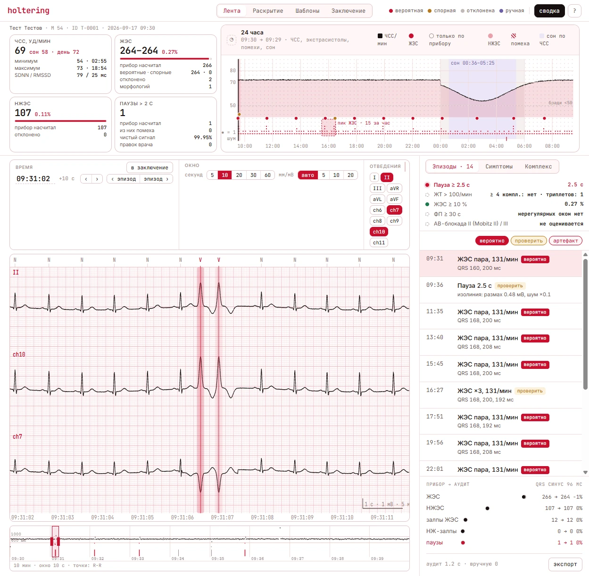
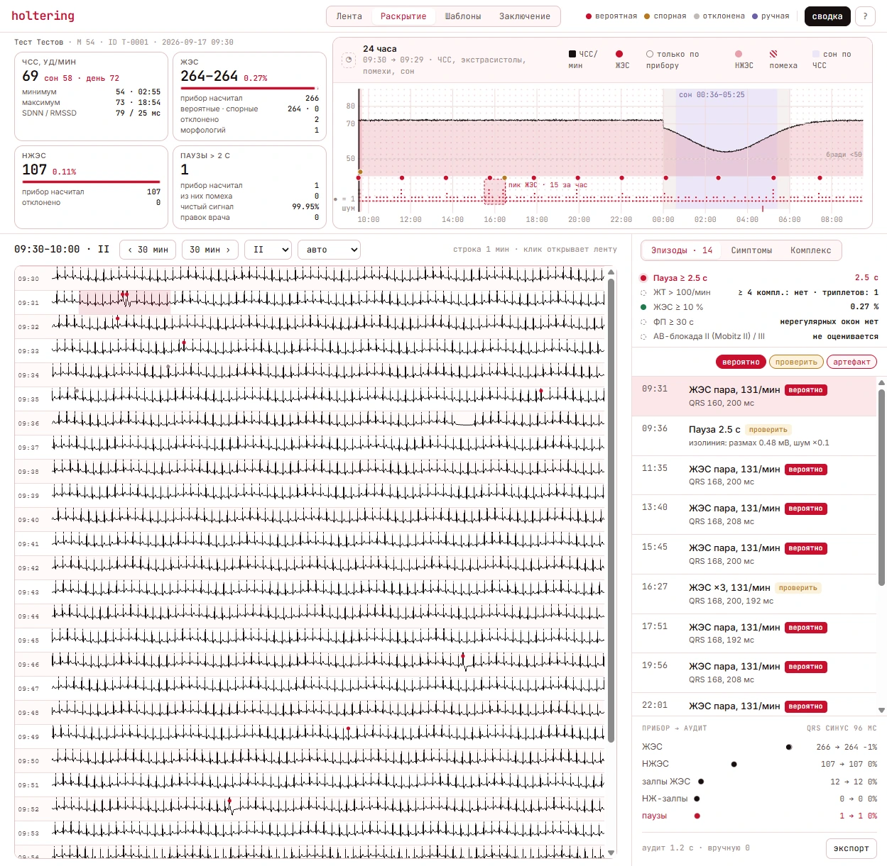
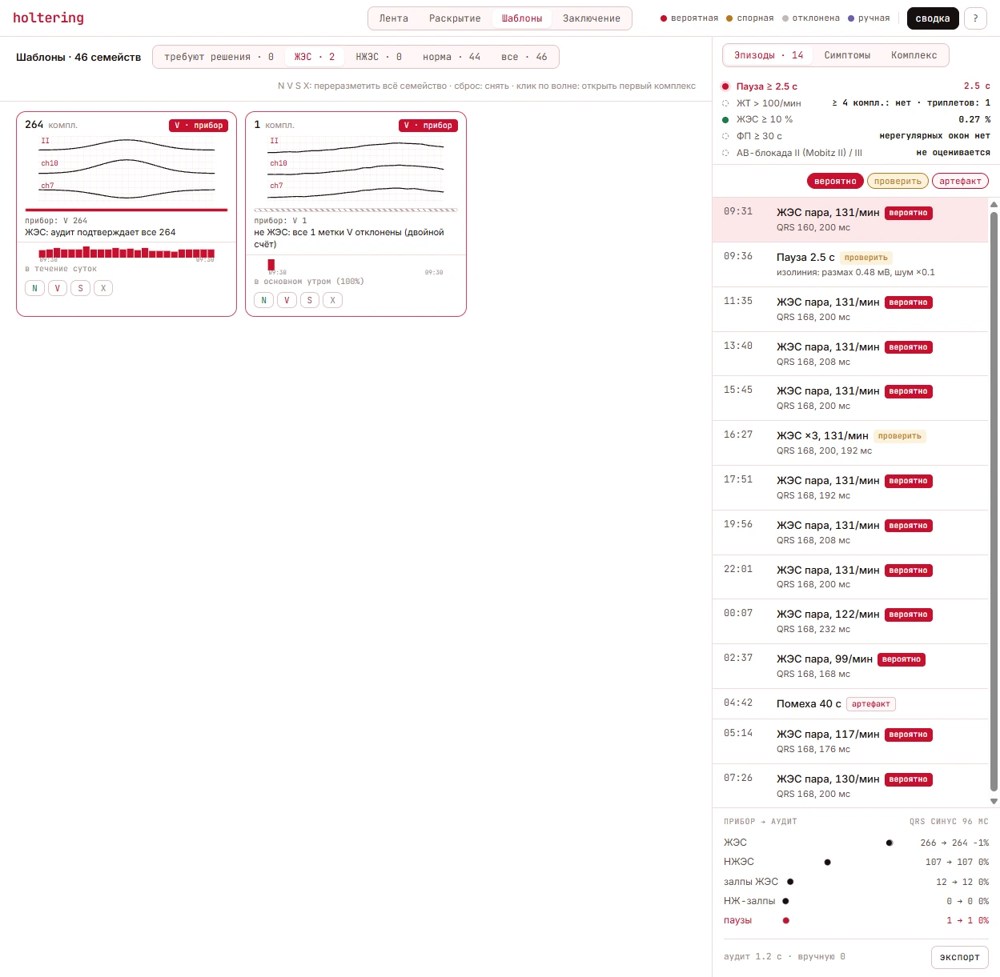
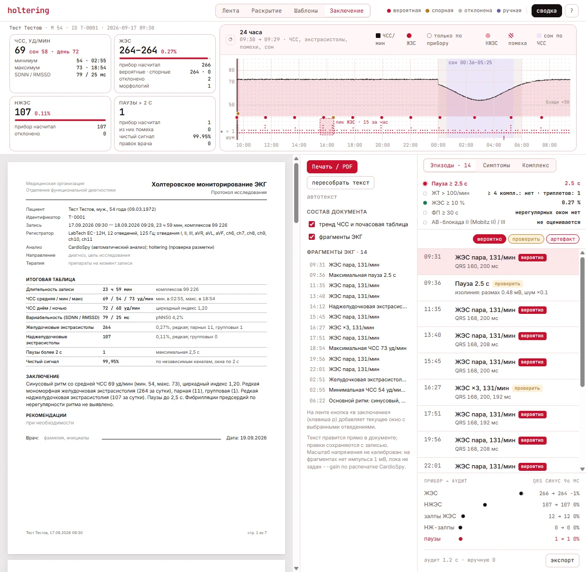

# holtering

[](https://github.com/chroniac/holtering/actions/workflows/check.yml)

Quality control for Holter ECG annotations. The recorder's software labels ~100 000
beats a day and gets some of them wrong: double-counted QRS complexes, labels sitting on
T waves, "ventricular" beats that are plain sinus beats in noise, pauses that are lead
drop-outs. `holtering` reads the raw 24-hour recording, audits every ectopic label the
device produced, explains each verdict, and gives the cardiologist a browser UI to
review, correct and print the protocol.

Input: the SCP-ECG export of a **LabTech EC-12H** recorder (`raw.scp`, 12 leads,
125 Hz, ~259 MB per 24 h) and the device annotation file (`qrs.txt`) from CardioSpy.
No proprietary SDK, no cloud: a Python service and a static frontend.

## Screens

| Strip | Disclosure |
|---|---|
|  |  |
| 12-lead strip with device labels, audit verdicts, the 24-hour overview (heart rate, ectopy, noise, estimated sleep) and the episode triage list. | Full disclosure, one minute per row, ectopic beats and episodes marked; a click opens the strip at that time. |

| Templates | Protocol |
|---|---|
|  |  |
| QRS morphology families; a whole family can be relabelled at once. One "V" family here is a double-counted sinus beat, rejected by the audit. | The printable A4 protocol: summary table, conclusion, hourly table and ECG strips; every paragraph is editable and the edits are stored with the record. |

The screenshots are taken on a synthetic 24-hour record (`tests/synth.py`); the patient
is fictional.

## What it checks

Every ectopic label from the device gets features and a verdict with reasons
([docs/modules/analysis.md](docs/modules/analysis.md)):

| Verdict | Meaning |
|---|---|
| `double-count` | coupling interval shorter than 300 ms — physiologically impossible |
| `on-wave` | amplitude below 50 % of the neighbouring sinus beats: the label is not on a QRS |
| `noisy` | local noise above 2.5× the record's baseline or above 25 % of the QRS amplitude, or the window is in noise |
| `too-wide` | the measured QRS is wider than 240 ms: the width was read off an artefact |
| `narrow` | a V label, but the QRS is no wider than the sinus one |
| `sinus-shape` | a V label, but the complex belongs to a morphology family that is >90 % sinus |
| `not-premature` | the complex is not premature against the preceding rhythm |
| `on-schedule` | the label came on the sinus schedule after a rejected one: the ordinary sinus beat |
| `uncertain` | borderline QRS width or contradictory features — for the reviewer |
| `likely` | passed every check |

On top of the beat audit: a per-window signal quality map (HF noise, spikes, rail hits,
baseline drift) on the eight independent channels, episodes for triage (pauses vs.
signal loss, ventricular and supraventricular runs, missed beats, noise blocks),
heart rate and HRV, sleep estimated from heart rate, and the five reading criteria
(pause ≥ 2.5 s, VT, PVC burden ≥ 10 %, AF screen, AV block) with the device's number
next to the audited one.

## Quick start

```bash
uv sync --group dev
uv run python tests/synth.py data 600            # a 10-minute synthetic record: data/raw.scp + data/qrs.txt
uv run holtering serve --data data --start "2026-09-17 09:30:00"
cd frontend && bun install && bun run build      # static UI, served by the backend at http://127.0.0.1:8790/
```

A real recording: `--data <dir with raw.scp and qrs.txt>` (or `--scp`/`--qrs`). The
heavy-pass cache and the reviewer's overrides are written next to the record.
Settings can also come from `holtering.toml` or `HOLTERING_*` variables
([docs/operations/config.md](docs/operations/config.md)).

## Performance

Measured with `scripts/bench.py` on a synthetic 24-hour record of the same size and
layout as a real export (`python tests/synth.py bench 86400`): 259 MB, 99 226 beats,
12 leads at 125 Hz, ectopy spread over the day. Machine: i9-14900KF, NVMe SSD,
Windows 11, CPython 3.14. Medians of 5 runs; the file had just been written, so it sits
in the OS page cache — on a cold HDD the first start additionally pays one sequential
read of the file.

| Step | Result |
|---|---|
| first start: parse + heavy pass + recompute (file in page cache) | 1.5 s |
| next start: parse + cached heavy pass + recompute | 170 ms |
| `recompute()` after a label edit | 76 ms |
| `GET /api/summary` | 1 ms, 2 kB |
| `GET /api/overview` (24 h minute HR + noise map) | 2 ms, 204 kB |
| `GET /api/beats?dur=10800` (3 h context strip) | 2 ms, 207 kB |
| `GET /api/ecg?dur=10` (12 leads) | 3 ms, 310 kB |
| `GET /api/ecg?dur=120` (12 leads) | 17 ms, 3.7 MB |
| `GET /api/raw?dur=3600` (one lead, int16) | 1 ms, 900 kB |
| `GET /api/templates` | 13 ms, 78 kB |
| `GET /api/report` (protocol text + strips) | 4 ms, 11 kB |
| `GET /api/export` (every beat) | 48 ms, 4.3 MB |
| `POST /api/annotations/{index}` (label edit + recompute) | 139 ms |
| process RSS after all of the above | 170 MB |

The heavy pass on a real 259 MB / 23.99 h export took 1.2 s on the same machine. The
signal is never loaded into memory: the parser is a zero-copy `numpy.memmap` over the
int16 matrix, the heavy pass streams each lead once, and the strip endpoints read only
the requested window. Where the numbers do change is the doctors' hardware
(Broadwell i3, HDD, 4–8 GB) — that is why the tool ships as a web application on a
server rather than a desktop executable ([ADR 0001](docs/adr/0001-web-app-not-desktop-exe.md)).

Reproduce:

```bash
uv run python tests/synth.py bench 86400
uv run python scripts/bench.py bench
```

## How it is built

```
packages/scp-holter/    scp_holter — SCP-ECG reader for the LabTech export: sections, patient
                        tags, lead definitions, zero-copy signal access; EDF+/SVG/CSV/NPY export;
                        CLI `scp-holter`
packages/holtering/     holtering — analysis (quality, beat audit, morphology families, rhythm,
                        protocol), Litestar API, `Settings`, CLI `holtering`
frontend/               Vite + TypeScript UI: strip, disclosure, templates, protocol
tests/                  pytest; synth.py generates the synthetic record used everywhere
scripts/                snapshot_api.py (API contract snapshot), bench.py, repo checks
docs/                   ADR, module notes, operations, changelog
```

The analysis runs in two passes. The **heavy pass** reads the whole signal once — quality
per window, an audit of every ectopic label, shape clustering, per-minute heart rate —
and is cached as JSON next to the record. **Recompute** runs on every reviewer action
(relabel, insert a beat, mark a span as noise, add a diary entry) and rebuilds the
episodes, counts, criteria and protocol in tens of milliseconds. Verdicts are
deterministic; every number in the UI can be traced to a rule in
[docs/modules/analysis.md](docs/modules/analysis.md).

The parser copes with what makes generic SCP-ECG readers reject these files: a zeroed
`SCPECG` marker, section version 10, per-lead byte counters that overflow `u16` on a
24-hour record, and channel indices in place of lead codes
([docs/modules/scp-holter.md](docs/modules/scp-holter.md)).

Stack: Python 3.14, numpy, Litestar, Dishka, msgspec, pydantic-settings, uv
workspace; Bun + Biome + Vite on the frontend
([ADR 0002](docs/adr/0002-stack.md)). The frontend targets Chrome 109 / Firefox ESR 115
because the reviewers' workstations run Windows 7/8.1.

## Status and limits

- The voltage scale is treated as uncalibrated until `--gain` is measured against a
  CardioSpy printout; the order of the six chest channels is unverified and labelled
  neutrally (`ch6…ch11`) until `--chest` is given.
- One record per process, no accounts: the current build is the reviewer's local tool.
  The record registry, upload with client-side pseudonymisation of the patient section,
  accounts and server-side PDF printing are the next steps
  ([docs/README.md](docs/README.md)).
- Tests and CI run on the synthetic record only; real recordings never enter the
  repository.

## Development

```bash
uv run ruff check . && uv run ruff format --check .
uv run ty check && uv run lint-imports && uv run pytest -q
python scripts/check_comment_blocks.py
cd frontend && bun run check && bun run comments && bun run typecheck && bun run build
```

Rules for contributors and agents: [AGENTS.md](AGENTS.md). Documentation index:
[docs/README.md](docs/README.md). Changes: [docs/CHANGELOG.md](docs/CHANGELOG.md).
